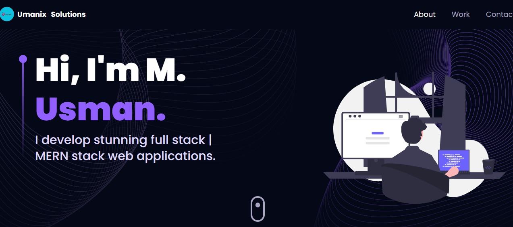

# My Portfolio

<picture>
  
</picture>

# Description

## My portfolio project:

### This is my portfolio web application which showcases my Web development skills that how much am I capable and passionate about creating web applications that are accessible, performant and visually appealing.

## The main goals of the project are:

1. Test my skills.
2. Upgrade my frontend development skills.
3. Upgrade my `Three.js` skills with `React.js`.

# Preview

### Preview link: https://portfolio-usman3c.web.app/

# Prerequisites

- Node.js should be installed on your machine.
- npm OR yarn should be available.

# Installation

To install my portfolio locally on your machine, follow these steps:

### 1. Clone the repository from github:

```
git clone https://github.com/Muhammad-Usman-Official/Portfolio.git
```

### 2. Navigate to the project:

```
cd Portfolio
```

### 3. Install the dependencies:

```
npm install --force
```

OR

```
yarn
```

## Usage

To run this portfolio on localhost, follow these steps:

1. Start the server

```
npm run dev
```

2. Open the browser and go to http://localhost:5173/

3. Enjoy!

## Lincense

This project uses the [MIT] license

## Contact

If you want to contact me, you can reach me at Musmant11@gmail.com

You can also follow me on https://www.linkedin.com/in/muhammad-usman-3c
